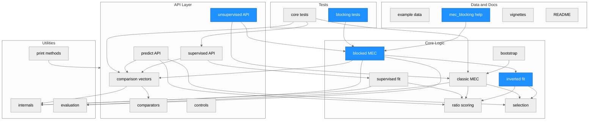
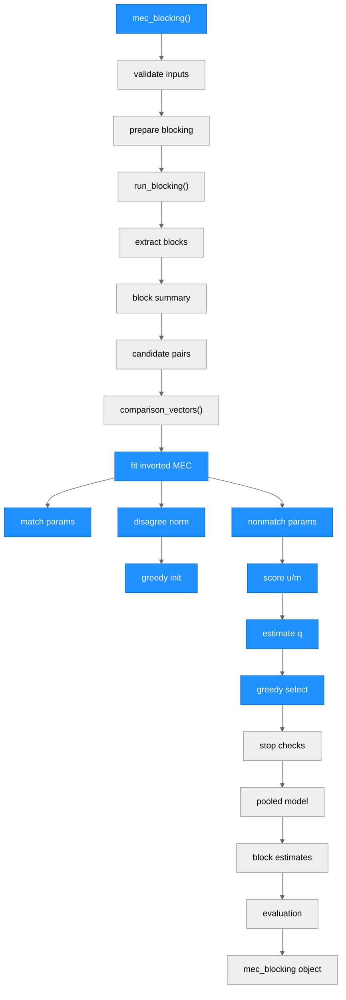
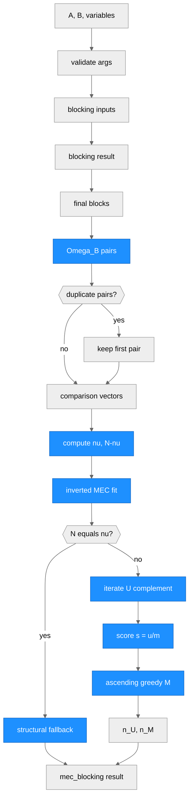

# Architecture - automatedRecLin

> Generated by scriber for run `REQ-20260517-122804-mec-blocking` on 2026-05-17.

## Overview

`automatedRecLin` is an R package for record linkage and entity resolution. Its main abstractions are comparison-vector construction, supervised and unsupervised MEC model fitting, prediction from trained models, and blocked unsupervised linkage through the external `blocking` package. The implementation is organized as a small R package using `data.table` for tabular data flow, `reclin2` for default comparators, `nleqslv` and `densityratio` for continuous estimation, and `FixedPoint` for fixed-point match-count calculations.

---

## Module Structure

### Module Reference

| Module / File | Layer | Purpose | Key Exports | Changed |
| --- | --- | --- | --- | --- |
| `R/comparison_vectors.R` | API | Builds pairwise comparison vectors for all pairs or supplied candidate pairs. | `comparison_vectors()` | no |
| `R/comparators.R` | API | Supplies comparator factories for numeric and string-distance comparisons. | `abs_distance()`, `jarowinkler_complement()` | no |
| `R/supervised_learning.R` | API/Core | Trains supervised record linkage models from known matches and optional custom ML models. | `train_rec_lin()`, `custom_rec_lin_model()` | no |
| `R/unsupervised_learning.R` | API/Core | Implements full-product MEC and blocked MEC workflows. | `mec()`, `mec_blocking()` | yes |
| `R/predict.R` | API/Core | Scores new record pairs with a trained supervised model and selects predicted matches. | `predict.rec_lin_model()` | no |
| `R/controls.R` | API | Provides controls for KLIEP density-ratio estimation. | `control_kliep()` | no |
| `R/internals.R` | Utils/Core | Shared validation, parameter-estimation, blocking, scoring, and selection helpers. | internal only | no |
| `R/eval.R` | Utils | Computes confusion counts, FLR, and MMR from predicted and true matches. | internal only | no |
| `R/methods.R` | Utils/API | Defines S3 print methods for public result classes. | S3 print methods | no |
| `R/bootstrap.R` | Core | Work-in-progress parametric bootstrap for MEC match-count uncertainty. | internal / unexported | no |
| `R/data.R` | Data | Documents package example datasets. | datasets | no |
| `man/mec_blocking.Rd` | Docs | Generated help page for blocked MEC. | help topic | yes |
| `inst/tinytest/test_mec_blocking.R` | Tests | Regression tests for blocked MEC output contracts and edge cases. | tests | yes |

---

## Function Call Graph

### Function Reference

| Function | Defined In | Called By | Calls | Changed | Purpose |
| --- | --- | --- | --- | --- | --- |
| `mec_blocking()` | `R/unsupervised_learning.R` | user / exported | blocking helpers, `comparison_vectors()`, `fit_mec_blocking_inverted_omega()`, evaluation helpers | yes | Public blocked unsupervised MEC entry point. |
| `validate_mec_blocking_compatibility_args()` | `R/unsupervised_learning.R` | `mec_blocking()` | `validate_nonmatch_sample_size()` | yes | Validates obsolete compatibility arguments without using them for sampling. |
| `prepare_blocking_inputs()` | `R/internals.R` | `mec_blocking()` | `build_blocking_input()` | no | Builds or validates inputs passed to `blocking::blocking()`. |
| `run_blocking()` | `R/internals.R` | `mec_blocking()` | `blocking::blocking()` | no | Executes external blocking. |
| `reconstruct_block_summary()` | `R/internals.R` | `mec_blocking()` | `data.table` operations | no | Rebuilds disjoint final block summaries from blocking output. |
| `make_block_pair_table()` | `R/internals.R` | `mec_blocking()` | `data.table::CJ()` | no | Expands final blocks into candidate pairs. |
| `comparison_vectors()` | `R/comparison_vectors.R` | `mec()`, `mec_blocking()`, `train_rec_lin()`, `predict.rec_lin_model()` | comparator functions, `validate_match_pairs()` | no | Creates `Omega` with `gamma_` comparison columns. |
| `fit_mec_blocking_inverted_omega()` | `R/unsupervised_learning.R` | `mec_blocking()` | inverted parameter, scoring, probability, and selection helpers | yes | Fits inverted MEC on the candidate-pair space. |
| `estimate_inverted_match_parameters()` | `R/unsupervised_learning.R` | `fit_mec_blocking_inverted_omega()` | `binary_formula()`, `estimate_hurdle_gamma_params()` | yes | Estimates match-side parameters from all blocked candidates. |
| `estimate_inverted_nonmatch_parameters()` | `R/unsupervised_learning.R` | `fit_mec_blocking_inverted_omega()` | `binary_formula()`, `estimate_hurdle_gamma_params()` | yes | Estimates nonmatch-side parameters from the current complement. |
| `score_inverted_mec_ratio()` | `R/unsupervised_learning.R` | `fit_mec_blocking_inverted_omega()` | `bernoulli_ratio()`, `hurdle_gamma_ratio()` | yes | Computes the inverted score `s = u / m`. |
| `blocking_disagreement_norm()` | `R/unsupervised_learning.R` | `fit_mec_blocking_inverted_omega()` | matrix operations | yes | Builds the initialization disagreement norm. |
| `select_inverted_mec_indices()` | `R/unsupervised_learning.R` | `fit_mec_blocking_inverted_omega()` | base ordering | yes | Selects one-to-one matches in ascending inverted score order. |
| `estimate_inverted_q()` | `R/unsupervised_learning.R` | `fit_mec_blocking_inverted_omega()` | numeric guards | yes | Estimates candidate nonmatch probabilities. |
| `blocking_diagnostics()` | `R/internals.R` | `mec_blocking()` | `data.table` joins | no | Reports blocking recall and candidate-pair reduction. |
| `evaluation()`, `get_metrics()`, `get_confusion()` | `R/eval.R` | `mec()`, `mec_blocking()`, `predict.rec_lin_model()` | base R | no | Reports linkage quality when truth is available. |

---

## Data Flow

---

## Architectural Patterns

- **Thin exported entry points**: Public functions validate user-facing arguments, normalize data to `data.table`, then delegate algorithmic work to internal helpers.
- **Shared comparison space**: `comparison_vectors()` is the common bridge from record data to MEC inputs for supervised fitting, unsupervised fitting, prediction, and blocked candidate-space fitting.
- **Method-specific parameter tables**: Binary, continuous parametric, continuous nonparametric, and hit-miss components are represented as separate `data.table` parameter blocks keyed by `gamma_` variable names.
- **Greedy one-to-one selection**: Both classic and blocked MEC use helper-level selection routines to enforce linkage constraints; blocked MEC now uses ascending `u / m` rather than descending `m / u`.
- **Compatibility-preserving outputs**: `mec_blocking()` keeps established result fields where feasible while updating their semantics for candidate-space inverted MEC.
- **Evaluation as optional post-processing**: Metrics and confusion matrices are only computed when `true_matches` is supplied.

---

## Notes

- The current run changed `mec_blocking()` from a selected-training-block and full-product nonmatch-sampling workflow to a single inverted fit on `Omega_B`, the blocked candidate-pair space.
- `mec_blocking()` supports `"binary"` and `"continuous_parametric"` methods. The broader `mec()` path still supports continuous nonparametric and hit-miss methods.
- Compatibility arguments such as `nonmatch_sample_size`, `nonmatch_sampling_seed`, `min_training_pairs`, and `fixed_method` remain in the signature but no longer drive the blocked MEC algorithm.
- `man/mec_blocking.Rd` and `inst/tinytest/test_mec_blocking.R` were updated by earlier workflow teammates to match the new candidate-space and `u_over_m` behavior.
