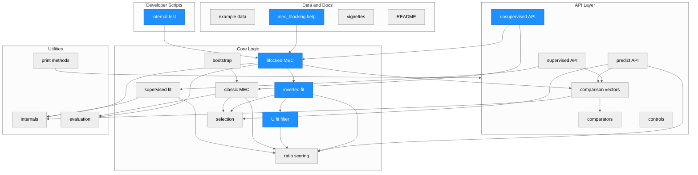
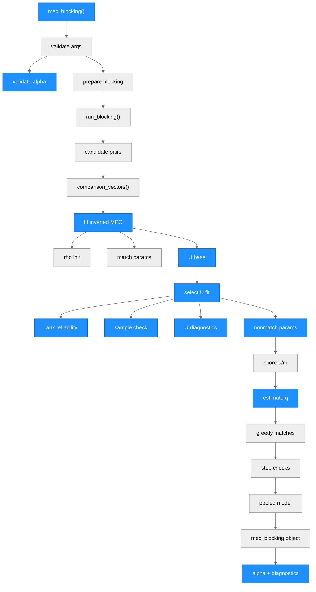
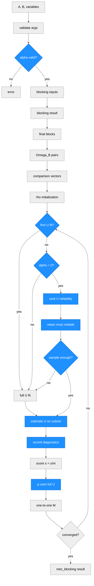

# Architecture - automatedRecLin

> Generated by scriber for run `20260519-nonmatch-fraction-alpha` on 2026-05-19.

## Overview

`automatedRecLin` is an R package for record linkage and entity resolution. Its main abstractions are comparison-vector construction, supervised and unsupervised MEC model fitting, prediction from trained models, and blocked unsupervised linkage through the external `blocking` package. The implementation is organized as a small R package using `data.table` for tabular data flow, `reclin2` for default comparators, `nleqslv` and `densityratio` for continuous estimation, and `FixedPoint` for fixed-point match-count calculations.

This run updates the blocked MEC path so `mec_blocking()` accepts `alpha`, a nonmatch drop fraction used only for later U-side distribution fitting. The first U-side fit remains uncorrected, posterior and count formulas continue to use the full current nonmatch complement, returned objects now include `u_fit_diagnostics`, and `internal/test.R` loads the current checkout directly with `devtools::load_all()`.

---

## Module Structure

### Module Reference

| Module / File | Layer | Purpose | Key Exports | Changed |
| --- | --- | --- | --- | --- |
| `R/comparison_vectors.R` | API | Builds pairwise comparison vectors for all pairs or supplied candidate pairs. | `comparison_vectors()` | no |
| `R/comparators.R` | API | Supplies comparator factories for numeric and string-distance comparisons. | `abs_distance()`, `jarowinkler_complement()` | no |
| `R/supervised_learning.R` | API/Core | Trains supervised record linkage models from known matches and optional custom ML models. | `train_rec_lin()`, `custom_rec_lin_model()` | no |
| `R/unsupervised_learning.R` | API/Core | Implements full-product MEC and blocked MEC workflows, including the new `alpha` U-side fitting path. | `mec()`, `mec_blocking()` | yes |
| `R/predict.R` | API/Core | Scores new record pairs with a trained supervised model and selects predicted matches. | `predict.rec_lin_model()` | no |
| `R/controls.R` | API | Provides controls for KLIEP density-ratio estimation. | `control_kliep()` | no |
| `R/internals.R` | Utils/Core | Shared validation, parameter-estimation, blocking, scoring, and diagnostics helpers. | internal only | no |
| `R/eval.R` | Utils | Computes confusion counts, FLR, and MMR from predicted and true matches. | internal only | no |
| `R/methods.R` | Utils/API | Defines S3 print methods for public result classes. | S3 print methods | no |
| `R/bootstrap.R` | Core | Work-in-progress parametric bootstrap for MEC match-count uncertainty. | internal / unexported | no |
| `R/data.R` | Data | Documents package example datasets. | datasets | no |
| `man/mec_blocking.Rd` | Docs | Generated help page for blocked MEC; manually synchronized for `alpha` and `u_fit_diagnostics`. | help topic | yes |
| `internal/test.R` | Developer script | Direct local validation script for blocked MEC; now loads the current checkout and runs multiple `alpha` values. | script | yes |

---

## Function Call Graph

### Function Reference

| Function | Defined In | Called By | Calls | Changed | Purpose |
| --- | --- | --- | --- | --- | --- |
| `mec_blocking()` | `R/unsupervised_learning.R` | user / exported | blocking helpers, `comparison_vectors()`, `fit_mec_blocking_inverted_omega()`, evaluation helpers | yes | Public blocked unsupervised MEC entry point; now exposes `alpha` and returns `u_fit_diagnostics`. |
| `validate_mec_blocking_alpha()` | `R/unsupervised_learning.R` | `mec_blocking()` | base checks | yes | Validates `alpha` as a single finite numeric value in `[0, 1)`. |
| `validate_mec_blocking_rho()` | `R/unsupervised_learning.R` | `mec_blocking()` | base checks | no | Validates the existing initialization fraction `rho`. |
| `validate_mec_blocking_robust_u()` | `R/unsupervised_learning.R` | `mec_blocking()` | base checks | no | Validates the existing experimental `robust_u` flag. |
| `prepare_blocking_inputs()` | `R/internals.R` | `mec_blocking()` | `build_blocking_input()` | no | Builds or validates inputs passed to `blocking::blocking()`. |
| `run_blocking()` | `R/internals.R` | `mec_blocking()` | `blocking::blocking()` | no | Executes external blocking. |
| `reconstruct_block_summary()` | `R/internals.R` | `mec_blocking()` | `data.table` operations | no | Rebuilds disjoint final block summaries from blocking output. |
| `make_block_pair_table()` | `R/internals.R` | `mec_blocking()` | `data.table::CJ()` | no | Expands final blocks into candidate pairs. |
| `comparison_vectors()` | `R/comparison_vectors.R` | `mec()`, `mec_blocking()`, `train_rec_lin()`, `predict.rec_lin_model()` | comparator functions, `validate_match_pairs()` | no | Creates `Omega` with `gamma_` comparison columns. |
| `fit_mec_blocking_inverted_omega()` | `R/unsupervised_learning.R` | `mec_blocking()` | inverted parameter, U-fit, scoring, probability, and selection helpers | yes | Fits inverted MEC on the blocked candidate-pair space. |
| `select_inverted_u_fit_indices()` | `R/unsupervised_learning.R` | `fit_mec_blocking_inverted_omega()` | `rank_u_fit_candidates()`, `has_sufficient_u_fit_sample()`, `make_u_fit_diagnostic()` | yes | Selects the retained U-side fitting subset for each iteration and records diagnostics. |
| `rank_u_fit_candidates()` | `R/unsupervised_learning.R` | `select_inverted_u_fit_indices()` | base ordering | yes | Orders current nonmatches by previous `q_est` or `ratio`, then `a`, `b`, and `block`. |
| `has_sufficient_u_fit_sample()` | `R/unsupervised_learning.R` | `select_inverted_u_fit_indices()` | `has_valid_u_cpar_fallback()` | yes | Checks whether the retained U-side subset can support binary and continuous-parametric estimation. |
| `make_u_fit_diagnostic()` | `R/unsupervised_learning.R` | `select_inverted_u_fit_indices()`, structural fallback | `data.table()` | yes | Builds the per-iteration `u_fit_diagnostics` row. |
| `estimate_inverted_match_parameters()` | `R/unsupervised_learning.R` | `fit_mec_blocking_inverted_omega()` | `binary_formula()`, `estimate_hurdle_gamma_params()` | no | Estimates match-side parameters from the current selected match set. |
| `estimate_inverted_nonmatch_parameters()` | `R/unsupervised_learning.R` | `fit_mec_blocking_inverted_omega()` | `binary_formula()`, `estimate_hurdle_gamma_params()` | no | Estimates nonmatch-side parameters from the selected U-side fitting subset. |
| `score_inverted_mec_ratio()` | `R/unsupervised_learning.R` | `fit_mec_blocking_inverted_omega()` | `bernoulli_ratio()`, `hurdle_gamma_ratio()` | no | Computes the inverted score `s = u / m`. |
| `estimate_inverted_q()` | `R/unsupervised_learning.R` | `fit_mec_blocking_inverted_omega()` | numeric guards | yes | Computes nonmatch posterior estimates using the full current nonmatch count. |
| `select_inverted_mec_indices()` | `R/unsupervised_learning.R` | `fit_mec_blocking_inverted_omega()` | base ordering | no | Selects one-to-one matches in ascending inverted score order. |
| `blocking_diagnostics()` | `R/internals.R` | `mec_blocking()` | `data.table` joins | no | Reports blocking recall and candidate-pair reduction. |
| `mec_selection_diagnostics()` | `R/internals.R` | `mec_blocking()` | `data.table` joins | no | Reports candidate-space MEC recall diagnostics when truth is available. |
| `evaluation()`, `get_metrics()`, `get_confusion()` | `R/eval.R` | `mec()`, `mec_blocking()`, `predict.rec_lin_model()` | base R | no | Reports linkage quality when truth is available. |

---

## Data Flow

---

## Architectural Patterns

- **Thin exported entry points**: Public functions validate user-facing arguments, normalize data to `data.table`, then delegate algorithmic work to internal helpers.
- **Shared comparison space**: `comparison_vectors()` is the common bridge from record data to MEC inputs for supervised fitting, unsupervised fitting, prediction, and blocked candidate-space fitting.
- **Candidate-space blocked MEC**: `mec_blocking()` fits one pooled inverted MEC model on the blocked candidate-pair space rather than sampled training blocks.
- **U-side fitting separation**: The U-side fitting subset can be smaller than the full current nonmatch complement, but posterior and count updates still use the full complement size.
- **Deterministic ranking and selection**: U-side retention ranks by previous nonmatch reliability with deterministic pair tie-breaking; final matches still use greedy one-to-one selection.
- **Compatibility-preserving outputs**: `mec_blocking()` keeps established result fields where feasible and adds explicit `alpha` and `u_fit_diagnostics` fields rather than overloading existing fields.
- **Evaluation as optional post-processing**: Metrics and confusion matrices are only computed when `true_matches` is supplied.
- **Direct checkout validation script**: `internal/test.R` uses `devtools::load_all(".", quiet = TRUE)` so direct script execution exercises the working-tree implementation instead of an installed package.

---

## Notes

- The current run changed the `mec_blocking()` API and documentation by adding `alpha`, top-level and `pooled_model` `alpha` fields, and `u_fit_diagnostics`.
- The first U-side fit records `reason = "first_u_fit_full"` and does not apply an `alpha` drop, even when `alpha > 0`.
- Later U-side fits may record `reason = "alpha_reliability_drop"`, `alpha_zero`, `requested_drop_zero`, `base_smaller_than_requested_keep`, or `minimum_sample_full_base`.
- `rho` initialization remains separate from `alpha`; tester evidence confirmed `n_M_init` did not vary across tested `alpha` values for the same `rho`.
- `man/mec_blocking.Rd` was manually synchronized for this run. `inst/tinytest` files were not changed in this run.
